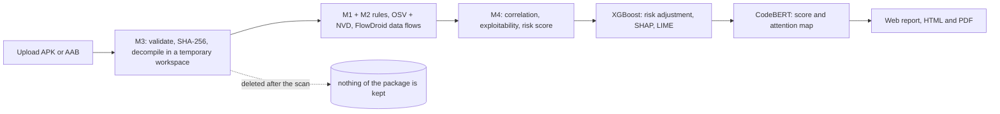
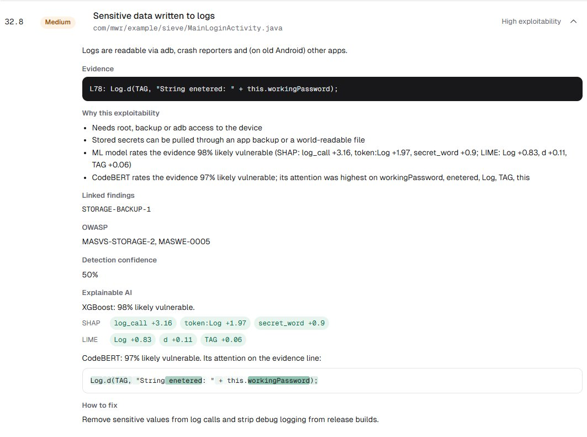

# AndroGuard feature documentation

**ML, explainable AI (SHAP, LIME, CodeBERT attention maps), evidence correlation, evidence-based exploitability assessment and privacy by design**

1 October 2026 · CT-499 FYDP, "An Explainable Static Security Analysis and Risk Assessment Platform for Android Applications" · code on the `main` branch · runnable image `minhal128/androguard` on Docker Hub

## Status at a glance

All six features asked about are implemented, tested and visible in the web report and the PDF report.

| Feature | Status | What it does | Proof |
|---|---|---|---|
| Machine learning | Implemented | Random Forest, XGBoost and a fine-tuned CodeBERT score how likely a finding's code line is vulnerable. XGBoost adjusts the risk by at most ±20%. | Metrics on 124,084 test lines (section 1) |
| XAI: SHAP | Implemented | Exact Shapley values (TreeSHAP) show which features raised the XGBoost score. | Shown on every finding with code evidence |
| XAI: LIME | Implemented | Removes words from the line at random, re-scores it and fits a local linear model, so each word gets a weight. | `tests/test_ml.py` |
| CodeBERT attention maps | Implemented | A heatmap over the evidence line shows where CodeBERT's attention went, plus the top 5 identifiers. | `tests/test_ml.py`, screenshot below |
| Evidence correlation | Implemented | Links findings that combine into attack chains, adds FlowDroid data flows and NVD details, and gives every finding the same standard fields. | `tests/test_m4.py` |
| Evidence-based exploitability | Implemented | Rates each finding HIGH, MEDIUM or LOW from observable factors, with the reasons written out, then computes a 0 to 100 risk score. | Held-out ranking (section 4.6) |
| Privacy by design | Implemented | Package and decompiled code live only in temporary folders that are deleted after every scan. Only findings, scores and the SHA-256 hash are kept. | `tests/test_api.py`, temp-folder check |
| OpenAI summaries (optional in the proposal) | Not implemented, by decision | See section 6 | |

How the pieces fit:





---

## 1. Machine learning

### 1.1 Role in the system
The proposal asks for ML-assisted risk where "deterministic rules and collected evidence will remain the foundation of the assessment". AndroGuard follows that:
- **Rules create findings. ML never does.** Each finding comes from a deterministic rule (M1, M2), a dependency advisory (OSV) or a traced data flow (FlowDroid).
- **ML scores the finding's evidence.** The classifier rates the code line behind each finding: how likely it is to be vulnerable.
- **ML adjusts the risk, within limits.** `risk = rule risk x (0.8 + 0.4 x probability)`. A finding moves by at most 20% up or down, so ML reorders findings of similar risk but cannot hide a serious one.

Why ML must not be the basis: a TrustManager that accepts every certificate (`TLS-TRUST-ALL`) is caught by its rule, which reads the method body. The line-level models only see the evidence line `public void checkServerTrusted(X509Certificate[] chain, String authType) ...` and rate it 1.8% (XGBoost) and 0.1% (CodeBERT). The rule is right and the models cannot see why.

### 1.2 Data
- **Dataset:** LVDAndro, the source-file subset labelled with MobSF (`LVDAndro_SourceFiles_MobSF_Processed.csv`). Each row is one line of Android code with a label: vulnerable or not.
- **Test set:** 124,084 lines. 1.76% of them are vulnerable, the real rate.
- **Training set:** 78,516 lines: every vulnerable line of the training split, plus 8 safe lines for each one. All models use the same split, so their scores compare.

### 1.3 Features (Random Forest and XGBoost)
322 binary features per line:
- **22 hand-made API-security signals.** Their names show up in the SHAP explanations:
  - `log_call`, `http_url`, `https_url`, `ip_literal`
  - `key_like_literal`, `secret_word`
  - `crypto_api`, `weak_crypto`, `tls_api`
  - `webview_setting`, `raw_sql`, `external_storage`, `file_write`, `world_mode`, `shared_prefs`
  - `hidden_view`, `url_param`, `intent_ipc`, `random`, `base64`, `clipboard`, `network_api`
- **The 300 most frequent code tokens** of the training lines.

CodeBERT reads the raw line instead. It uses up to 64 tokens; the median line is 46 characters.

### 1.4 Models and results
All three models were tested on the same 124,084 lines.

| Model | Precision | Recall | F1 | ROC-AUC | PR-AUC |
|---|---|---|---|---|---|
| Random Forest | 0.363 | 0.934 | 0.522 | 0.981 | 0.634 |
| **XGBoost (deployed)** | **0.652** | 0.863 | **0.743** | 0.982 | **0.659** |
| CodeBERT, fine-tuned | 0.577 | 0.932 | 0.713 | **0.990** | 0.642 |

- **Why XGBoost is deployed.** The proposal names Random Forest as the primary model and XGBoost as the comparison. On this data XGBoost is clearly better, so it is deployed and Random Forest stays as the baseline. Random Forest finds a few more vulnerable lines (recall 0.934) but at about half the precision (0.363).
- **CodeBERT.** `microsoft/codebert-base`, fine-tuned for one epoch on 14,400 lines (1,600 vulnerable, the same 1:8 ratio) with AdamW at a learning rate of 2e-5. Training took 44 minutes on a laptop CPU.
  - It separates vulnerable from safe lines best (ROC-AUC 0.990).
  - XGBoost wins on F1 and PR-AUC, the measures that matter when fewer than 2% of lines are vulnerable. XGBoost also trained on 5 times more lines.
  - So XGBoost adjusts the risk, and CodeBERT gives its own score and its attention map.
- **Accuracy is not reported for model choice.** With only 1.76% positives, a model that calls every line safe would score 98.2%. For the record, Random Forest's accuracy is 0.970 and XGBoost's is 0.990.

### 1.5 Where it is

| What | File |
|---|---|
| Features, training, XGBoost scoring, SHAP, LIME | `app/modules/ml/code_model.py` |
| Deployed model and its metrics | `app/modules/ml/model.json`, `app/modules/ml/meta.json` |
| CodeBERT fine-tuning, scoring, attention map | `app/modules/ml/codebert.py`, metrics in `app/modules/ml/codebert_meta.json` |
| Retrain | `python -m app.modules.ml.code_model <LVDAndro csv>` and `python -m app.modules.ml.codebert <LVDAndro csv>` |

---

## 2. Explainable AI

Each finding with a code line as evidence carries three explanations:
- SHAP for XGBoost's score
- LIME for XGBoost's score
- CodeBERT's attention map

They are shown in the "Explainable AI" panel of the web report and in the PDF report.

### 2.1 SHAP: feature contributions
- **Method.** TreeSHAP computes exact Shapley values for tree models. XGBoost calculates them itself (`pred_contribs=True`), so no extra package is needed.
- **Output.** The three features that raised the score most, in log-odds units. Example: `log_call +3.16, token:Log +1.97, secret_word +0.9`.
- **Reading it.** SHAP answers "which of the model's 322 features pushed this score up".

### 2.2 LIME: local word weights
- **Method.** LIME (Ribeiro, Singh and Guestrin, 2016), text version, in `code_model.lime`:
  1. Split the evidence line into its words.
  2. Make 500 copies of the line with random words removed. The first copy stays complete.
  3. Score every copy with XGBoost.
  4. Weight each copy by how close it is to the original line: cosine distance with LIME's own text kernel (width 25).
  5. Fit a weighted ridge regression on "word present or not". Its coefficients are the word weights.
- **Implementation.** scikit-learn and NumPy, which are already in the project. A fixed random seed makes the same line always get the same explanation. One line takes about 0.05 seconds.
- **Reading it.** The weights are in probability points: `Log +0.83` means the line's vulnerable probability is about 83 points higher with `Log` in it than without. LIME answers "which words of this line drive the score". It is model-agnostic, so it checks SHAP from a different angle.

Examples from the deployed model:

| Evidence line | XGBoost | SHAP (top 3) | LIME (top 3) |
|---|---|---|---|
| `Log.d(TAG, "String enetered: " + this.workingPassword);` (Sieve) | 98% | log_call +3.16, token:Log +1.97, secret_word +0.9 | Log +0.83, d +0.11, TAG +0.06 |
| `Cipher cipher = Cipher.getInstance("DES/ECB/PKCS5Padding");` | 84% | weak_crypto +2.5, token:getInstance +2.04, crypto_api +1.28 | getInstance +0.58, Cipher +0.24, DES +0.11 |
| `String url = "http://example.com/api?token=" + token;` | 25% | url_param +1.78, secret_word +1.32, token:url +0.47 | token +0.22, url +0.05, com -0.03 |
| `textView.setText(R.string.app_name);` | 0.4% | nothing above 0.05 | every word below 0.05 |

SHAP and LIME agree on these lines, each in its own terms. For the log line, both put the log call first. For the cipher line, both name the `getInstance` call and the weak algorithm.

### 2.3 CodeBERT attention maps
- **Method.** In `codebert.insights`:
  1. Run the fine-tuned CodeBERT on the evidence line.
  2. Take the last layer's attention from the classification token `<s>` to every token of the line, averaged over the 12 attention heads.
  3. Merge the byte-pair pieces back into whole identifiers. Each identifier gets the sum of its pieces' attention.
  4. Scale to 0 to 1, from least to most attended.
- **Output:**
  - a heatmap over the evidence line in the web and PDF reports
  - the five identifiers with the most attention, in the "Why this exploitability" list
  - CodeBERT's own probability
- **Example (Sieve, 97% likely vulnerable):** `workingPassword` 1.00, `enetered` 0.77, `(` 0.36, `Log` 0.33, `String` 0.00. The model looked mostly at the password variable and at the text around it.
- **Limits:**
  - Attention shows where the model looked, not a proof of cause (Jain and Wallace, 2019). This is why SHAP and LIME are given too.
  - Lines longer than 64 tokens are cut.
  - CodeBERT is optional at runtime. Without PyTorch or the 479 MB model, scans run the same, minus this view. The Docker image includes both.

---

## 3. Evidence correlation (proposal Phase 7)

The correlation engine (`app/modules/m4_risk_engine/correlator.py`) combines observations from:
- the APK rules (M1)
- the API rules (M2)
- the dependency check (OSV with NVD)
- FlowDroid's data flows

### 3.1 Attack chains
A chain fires when the app has at least one finding in every "needs" group. Every target finding in the chain then becomes HIGH exploitability, gets the reason added, and lists the supporting findings under `related`.

| # | Target findings | Needs | Reason given in the report |
|---|---|---|---|
| 1 | HTTP-ENDPOINT, URL-SENSITIVE-PARAM, DATAFLOW-URL | CLEARTEXT-TRAFFIC | The network config allows cleartext and the app uses http:// endpoints, so the traffic can be intercepted |
| 2 | TLS-TRUST-ALL, TLS-HOSTNAME-ALL, TLS-WEBVIEW-SSL-ERROR | any API endpoint, key, secret, sensitive URL or auth finding | Certificate checks are disabled for an app that calls API endpoints: any man-in-the-middle sees the traffic |
| 3 | API-SECRET, API-KEY, AUTH-HARDCODED-BASIC, SECRET- | HTTP-ENDPOINT, CLEARTEXT-TRAFFIC, TLS-TRUST-ALL or TLS-HOSTNAME-ALL | The credential can also be captured on the network, without decompiling the app |
| 4 | WEBVIEW-JS-BRIDGE | HTTP-ENDPOINT, CLEARTEXT-TRAFFIC, WEBVIEW-MIXED-CONTENT or TLS-WEBVIEW-SSL-ERROR | Page content can be injected over the network and then call the exposed native bridge |
| 5 | WEBVIEW-FILE-URL-ACCESS, WEBVIEW-FILE-ACCESS | EXPORTED-COMPONENT | Other apps can drive an exported component and may make the WebView load a malicious file URL |
| 6 | CRYPTO-HARDCODED-KEY, CRYPTO-STATIC-IV | stored secrets, external storage, world-readable files or backups allowed | The key and the stored data are both on the device, so the encryption can be reversed |
| 7 | STORAGE-PREFS-SECRET, STORAGE-SQL-SECRET, STORAGE-LOG-SECRET, DATAFLOW-STORAGE | STORAGE-BACKUP or STORAGE-WORLD-MODE | Stored secrets can be pulled through an app backup or a world-readable file |

Chain 3 is the proposal's own example: "a hardcoded API credential combined with an insecure HTTP endpoint".

### 3.2 Data-flow correlation
- When FlowDroid traces sensitive data into a class, rule findings of the same category in that class get:
  - confidence of at least 0.8
  - the factor "FlowDroid traced sensitive data into this class"
  - a link to the flow
- Flows into a URL join chain 1. Flows into storage join chain 7.
- FlowDroid's accuracy on DroidBench (63 apps, 59 known leaks): precision 0.900, recall 0.763, F1 0.826.

### 3.3 Dependency enrichment
An OSV advisory for a bundled library, and its NVD record (CVSS score and CWE), become one finding with both references.

### 3.4 Standard finding
Every finding has the fields Phase 7 asks for:
- ID, title, category, description and cause
- supporting evidence (`file:line`) and the affected file or component
- severity and confidence
- exploitability with its reasons
- risk score and related findings
- OWASP MASVS and MASWE mapping
- remediation

### 3.5 Real example: InsecureBankv2
- 23 findings, app risk HIGH (72.0). 15 findings are highly exploitable, and 8 of them are in attack chains.
- `CRYPTO-HARDCODED-KEY-1` (risk 61.6) starts as MEDIUM: "Key is extractable from the APK; the attacker still needs the encrypted data". Chain 6 then raises it to HIGH, because the app also stores secrets in SharedPreferences, world-readable files and external storage, and allows backups. It links 5 storage findings.
- `SECRET-CREDENTIAL-1` becomes HIGH through chain 3, with `CLEARTEXT-TRAFFIC-1` and three `HTTP-ENDPOINT` findings as the evidence.

---

## 4. Evidence-based exploitability assessment (proposal Phase 8)

### 4.1 The proposal's factors and how they are measured

| Proposal factor | What AndroGuard checks | Rule prefixes |
|---|---|---|
| Component exposure | Exported without a strong permission: any installed app can reach it | `EXPORTED-COMPONENT` (HIGH), chain 5 |
| Permissions | Custom permissions any app can obtain, service-account keys, dangerous permissions | `PERM-WEAK-CUSTOM`, `PERM-SERVICE-ACCOUNT` (HIGH); other `PERM-` (LOW, raises the impact of other issues) |
| Authentication configuration | Static credentials in the app, OAuth redirects another app can catch | `AUTH-HARDCODED-BASIC` (HIGH), `AUTH-` (MEDIUM), chain 3 |
| Security-sensitive data flows | FlowDroid source-to-sink flows | `DATAFLOW-URL` (MEDIUM), `DATAFLOW-` (LOW), chains 1 and 7, raised confidence |
| Affected functionality | What the attacker needs, by the function involved | Offline APK access: `SECRET-`, `API-`. A network position: `TLS-`, `CLEARTEXT-`, `HTTP-ENDPOINT`. Device access: `STORAGE-`. Attacker content: `WEBVIEW-`. The encrypted data: `CRYPTO-` |

### 4.2 Levels
- **HIGH:** exploitable remotely or by any installed app, without extra conditions.
- **MEDIUM:** needs one condition, such as a network position or server-side misuse.
- **LOW:** needs device access, or only raises the impact of other issues.

### 4.3 Base rules
The first matching prefix wins, so specific prefixes come first. Attack chains (section 3.1) can then raise a finding to HIGH. A vulnerable dependency starts at MEDIUM: "Known advisory for the bundled library version; reachability not verified".

| Prefix | Level | Reason shown in the report |
|---|---|---|
| EXPORTED-COMPONENT | HIGH | Any installed app can reach it: exported without a strong permission |
| PERM-WEAK-CUSTOM | HIGH | Any installed app can obtain the weak custom permission |
| STORAGE-WORLD-MODE | HIGH | Any app on the device can read or modify the file |
| PERM-SERVICE-ACCOUNT | HIGH | Key file is extractable from the APK and grants server-level API access |
| API-SECRET | HIGH | Extractable offline from the APK and usable remotely against the API |
| API-KEY-AWS | HIGH | Extractable offline from the APK and usable against AWS |
| AUTH-HARDCODED-BASIC | HIGH | Static credentials are extractable from the APK |
| SECRET- | HIGH | Extractable offline from the APK by decompiling it |
| API-KEY | MEDIUM | Extractable from the APK; impact depends on server-side key restrictions |
| TLS- | MEDIUM | Needs a network position (shared Wi-Fi, rogue access point) to intercept traffic |
| CLEARTEXT-, HTTP-ENDPOINT | MEDIUM | Needs a network position to read or modify cleartext traffic |
| URL-SENSITIVE-PARAM | MEDIUM | Leaks through server, proxy and analytics logs |
| DATAFLOW-URL | MEDIUM | Leaks through server, proxy and analytics logs; FlowDroid traced the data flow |
| DATAFLOW- | LOW | Needs adb, root or backup access to the device; FlowDroid traced the data flow |
| AUTH- | MEDIUM | Needs a malicious app on the device to intercept the OAuth redirect |
| WEBVIEW-JS-BRIDGE | MEDIUM | Exploitable once the WebView renders attacker-controlled content |
| WEBVIEW-FILE-URL-ACCESS | MEDIUM | Exploitable once the WebView loads an attacker-controlled file |
| WEBVIEW- | LOW | Needs attacker-controlled content inside the WebView |
| CRYPTO-HARDCODED-KEY | MEDIUM | Key is extractable from the APK; the attacker still needs the encrypted data |
| CRYPTO- | LOW | The attacker first needs access to the encrypted or hashed data |
| STORAGE-EXTERNAL | MEDIUM | Apps with storage access (and the user) can read shared storage |
| STORAGE- | LOW | Needs root, backup or adb access to the device |
| ENDPOINT- | LOW | Endpoint found in the APK; exploitation depends on the backend's configuration |
| PERM- | LOW | Raises the impact of other issues; not exploitable on its own |

### 4.4 Confidence
Every rule has a detection confidence that says how reliable it is, from 0.5 for broad patterns to 0.95 for exact matches such as a Google API key format. A traced data flow raises a matching finding's confidence to at least 0.8. The web report shows it as "Detection confidence".

### 4.5 Risk score and app risk
`risk = 100 x severity weight x exploitability weight x confidence`, then the ML adjustment (x0.8 to x1.2).

| Severity | Weight | Exploitability | Weight |
|---|---|---|---|
| CRITICAL | 1.0 | HIGH | 1.0 |
| HIGH | 0.8 | MEDIUM | 0.7 |
| MEDIUM | 0.55 | LOW | 0.4 |
| LOW | 0.3 | | |
| INFO | 0.1 | | |

- A finding without a confidence (a dependency advisory) counts 0.6.
- The app risk is the worst finding: HIGH from 50, MEDIUM from 25.
- Worked example, the Sieve log finding in the screenshot:
  1. Base score: MEDIUM (0.55) x HIGH exploitability, through chain 7 (1.0) x confidence 0.5 = 27.5.
  2. XGBoost rates the line 98%, so the score is multiplied by 0.8 + 0.4 x 0.982 = 1.193.
  3. Final risk: **32.8**.

### 4.6 Does it help? Rule-only baseline against the hybrid system
The proposal asks to compare the hybrid system with a rule-only approach. Below, "relevant" means the finding's category is one of the app's documented vulnerabilities. The held-out apps (DIVA, Sieve, InjuredAndroid, Allsafe, Vuldroid) were never used to write or tune the rules.

| Ordering of findings | Held-out precision@5 | Held-out precision@10 | Held-out MAP | Development MAP |
|---|---|---|---|---|
| Rule-only (severity, then confidence) | 0.64 | 0.68 | 0.734 | 0.954 |
| + exploitability and attack chains | **0.84** | **0.78** | **0.811** | 0.964 |
| + ML-assisted risk (final) | **0.84** | 0.76 | 0.806 | **0.965** |

- The exploitability assessment puts documented vulnerabilities higher: held-out MAP goes from 0.734 to 0.811, and precision@5 from 0.64 to 0.84.
- The ML adjustment is neutral on held-out apps and helps slightly on the development apps.
- Detection on the held-out apps: precision 0.875, recall 0.946, F1 0.909. Source: `eval/results_heldout.md`.

---

## 5. Privacy by design

The proposal asks to process packages "within temporary isolated workspaces and deleting them after analysis, while retaining only necessary metadata, findings, features, scores, and report information".

### 5.1 What happens to each piece of data

| Data | Where it lives | When it is deleted |
|---|---|---|
| Uploaded APK or AAB | A temporary folder, under a random server-chosen name. The user's file name never reaches the tools. | When its scan ends: done, failed or cancelled (`app/api.py`, `finally` block) |
| Decompiled code, apktool and jadx output, FlowDroid results | A new temporary folder per scan (`WorkspaceManager`, `tempfile.TemporaryDirectory`) | When the scan leaves the workspace, also when it fails |
| File name, SHA-256, findings with their evidence lines, scores, report | The database (SQLite, or PostgreSQL in Docker) | When an admin deletes the scan. When an account is deleted, its scans are deleted too. |
| Passwords | Only as scrypt hashes | With the account |
| Sessions | An HttpOnly cookie with a random token. The database keeps only its SHA-256, so a database leak exposes no tokens. | At logout, at expiry, or when the user is blocked |

### 5.2 What leaves the machine
- Only the names and versions of bundled libraries, sent to OSV, and CVE IDs, sent to NVD, to look up known vulnerabilities.
- No code, file or finding is sent anywhere. There is no LLM or other cloud analysis, which is why the optional OpenAI summaries were left out (section 6).

### 5.3 Access control
- Every scan belongs to its account, or to its browser for free-trial scans. Anyone else gets 404.
- Admins see scans in the CRM. Only the superadmin can change roles or delete accounts.
- Five failed logins in 15 minutes lock that login.

### 5.4 Proof
```
$ python tests/test_api.py
[OK] API check passed: free trial quota, ownership, signup claim, login limit, cancel, roles, block and delete
```
- The test fails if any uploaded package still exists after its scan, or if a user's file name reaches the tools.
- After more than 30 scans on 1 October (benchmarks, web scans and cancelled scans), the temporary folder held **0 leftover workspaces and 0 leftover uploads**. Check it yourself after any scan:
```
python -c "import glob, os, tempfile; t = tempfile.gettempdir(); print(glob.glob(os.path.join(t, 'androguard_m3_*')), os.listdir(os.path.join(t, 'androguard_uploads')))"
```

One caution remains: the evidence lines in a report can contain the scanned app's real keys. Reports are visible only to their owner and to admins; keep exported PDFs private as well.

---

## 6. Is it 100%?

**These six features: yes, 100%.** Each is implemented, has a runnable check, and shows in the web and PDF reports.

**The whole proposal: about 98%.** What is left:

| Item | Status | Reason |
|---|---|---|
| OpenAI summaries | Not implemented, by decision | The proposal makes it optional ("may be used, where appropriate"). Evidence lines can contain the scanned app's real keys and passwords, and sending them to a third-party API would break privacy by design. The reports already have human-readable descriptions from the reviewed knowledge base. It can be added later as an opt-in with secrets masked. |
| Deployment on a real Ubuntu server | Not done | The Docker image is public and runs on any Linux host. It was tested with Docker Desktop. A server is needed from the university or the team. |
| Ghera and OWApp datasets | Not used | Five other intentionally vulnerable apps form the held-out test set, plus DroidBench for data flows. |
| Thesis and presentation | Team work | Not counted |

Known limits, also listed in `docs/PROGRESS_REPORT.md`:
- False alarms on benign apps (rate 0.375), mostly `http://` strings the apps never call.
- FlowDroid 2.13 traced flows in 3 of the 12 benchmark apps.
- CodeBERT was fine-tuned on a CPU with 14,400 lines.

## 7. Try it

```bash
docker run -d -p 8000:8000 -v androguard-db:/srv/db --name androguard minhal128/androguard
```
1. Open http://localhost:8000 and upload an APK. Three scans are free without an account.
2. Open any finding to see its exploitability reasons, linked findings, detection confidence and the Explainable AI panel (SHAP, LIME and the CodeBERT attention map).
3. Download the PDF to see the same in print.

All checks:
```bash
python tests/test_ml.py
python tests/test_m4.py
python tests/test_api.py
```
