# AndroGuard progress report

1 October 2026 · branch `feat/finish-proposal` · proposal: CT-499 FYDP, "An Explainable Static Security Analysis and Risk Assessment Platform for Android Applications"

## Summary

| | |
|---|---|
| Done | **about 98%** of the proposal (98.2% weighted by effort) |
| Remaining | OpenAI summaries (optional in the proposal), deployment on a real Ubuntu server, the Ghera and OWApp datasets. The thesis and the presentation are not counted. |
| Run it anywhere | `docker run -d -p 8000:8000 -v androguard-db:/srv/db --name androguard minhal128/androguard` ([Docker Hub](https://hub.docker.com/r/minhal128/androguard)) |
| Proof | Every item under "What is done" was run on 30 September or 1 October 2026. The outputs and screenshots below come from those runs. |

New since the 78% report of 30 September:
- CodeBERT, with attention maps
- LIME next to SHAP
- FlowDroid data flows
- NVD enrichment
- Scan timeout and cancel
- A real `.aab` test
- Held-out, benign and DroidBench evaluations
- The rule-only baseline comparison
- Scan time and memory
- The Docker image with PostgreSQL, published on Docker Hub

The accounts, free trial and admin CRM were not in the proposal. They add product value but are not counted.

## Progress by proposal phase

Weights are the effort share of each phase (the same weights as the earlier milestone table).

| # | Phase | Weight | Done | What exists | What is missing |
|---|---|---|---|---|---|
| 1 | Literature review and requirements | 2 | 100% | Proposal, scope, 16 categories | |
| 2 | Environment and tool setup | 5 | 95% | Python, FastAPI, SQLAlchemy, PostgreSQL, React, apktool, jadx, bundletool, FlowDroid, scikit-learn, XGBoost, PyTorch + Transformers, Docker | Redis (not needed with one scan worker, see below) |
| 3 | Datasets and benchmarks | 10 | 95% | LVDAndro; 4 development apps; 5 held-out apps; 3 benign F-Droid apps; DroidBench (63 apps) | Ghera and OWApp |
| 4 | API-security ML model | 13 | 100% | Random Forest, XGBoost and fine-tuned CodeBERT on the same test lines; SHAP | |
| 5 | Core static-analysis engine | 15 | 100% | 45 rules over 16 categories, FlowDroid data flows, CLI scanner | |
| 6 | Input processing and dependency matching | 10 | 100% | Validation, SHA-256, isolated workspace, AAB (tested on a real bundle), OSV + NVD, timeout and cancel | |
| 7 | Correlation and standardization | 8 | 100% | Standard finding schema, attack chains, data-flow correlation | |
| 8 | Risk, exploitability and explainable AI | 12 | 95% | Exploitability with reasons, risk score, ML-assisted risk, SHAP, LIME, CodeBERT attention maps | OpenAI summaries (optional; left out for privacy) |
| 9 | Remediation knowledge base and web app | 15 | 100% | Web app, HTML/PDF reports, accounts, CRM, confidence, explainable-AI and data-flow panels | |
| 10 | Testing, evaluation and deployment | 10 | 95% | Tests; development, held-out and benign benchmarks; rule-only baseline; time and memory; DroidBench; Docker image on Docker Hub | Deployment on a real Ubuntu server |
| | **Total** | **100** | **98.2%** | | |

## What is done, and proof that it works

### 1. Input processing (M3), phase 6
- Accepts `.apk` and `.aab`; checks the extension, the ZIP structure and the manifest entry; hashes the file with SHA-256.
- Converts AAB to APK with bundletool, then decompiles with apktool (`-s`) and jadx (`-r`, 4 GB heap cap).
- Works inside a temporary isolated workspace that is deleted after every scan.
- Reads bundled library versions and checks them against OSV (8 lookups in parallel). Each CVE then gets its CVSS score and CWE from NVD.
- Every tool run stops after 15 minutes (`ANDROGUARD_TOOL_TIMEOUT`). The whole process tree is killed: `taskkill /T` on Windows, a process-group kill on Linux.
- Out-of-memory and full-disk failures show a plain message instead of a JVM log.

Proof:
```
$ python tests/test_m3_fixes.py
[OK] M3 fixes check passed
$ python -c "from app.modules.m3_input_processor.deps import nvd_details; print(nvd_details('CVE-2021-0341'))"
('NVD CVE-2021-0341: CVSS 7.5 HIGH, CWE-295', 'HIGH')
```
`test_m3_fixes` also checks that a hung tool is killed at its timeout, that a cancel stops a running tool, and how NVD answers are read.

Real `.aab`: InsecureBankv2 was rebuilt as an Android App Bundle (2.9 MB, with aapt2 and `bundletool build-bundle`). Scanning the bundle gives the same 23 findings and risk 72.0 as the APK. No finding differs.

### 2. APK security analyzer (M1), phase 5
28 deterministic rules over the manifest, network security config, `strings.xml`, assets and the decompiled Java. It covers the 8 APK categories: hardcoded secrets, insecure data storage, insecure cryptography, exported components, insecure permissions, insecure WebView, cleartext traffic and improper SSL/TLS validation.

Each finding carries `file:line` evidence, severity, confidence, the OWASP MASVS/MASWE mapping and the remediation.

Proof:
```
$ python tests/test_m1.py
[OK] M1 check passed: 35 findings, all 28 rules fired, negatives clean
```

### 3. API security analyzer (M2), phase 5
17 rules for the 8 API categories: hardcoded API keys and secrets, insecure API endpoints, HTTP endpoints, sensitive data in URLs, weak authentication, insecure TLS configuration and excessive API permissions. It also scans React Native / Hermes bundles.

Proof:
```
$ python tests/test_m2.py
[OK] M2 check passed: 25 findings, all 17 rules fired, negatives clean
```

### 4. Data flows with FlowDroid, phases 5, 6 and 7
- FlowDroid 2.13 runs after the rules with its default list of sources and sinks. It gets 2 minutes for the data-flow step and 5 minutes in total (`ANDROGUARD_FLOWDROID_TIMEOUT`). If it is missing or fails, the scan goes on and the report says why.
- Flows into the log, SharedPreferences, files or a URL become findings (`DATAFLOW-LOG`, `DATAFLOW-STORAGE`, `DATAFLOW-URL`) with their MASVS/MASWE mapping.
- Every flow is listed in the web report and the HTML/PDF report, the security sinks first.
- Correlation (M4): a traced flow raises the confidence of rule findings of the same category in the same class to at least 0.8 and links them. `DATAFLOW-URL` joins the cleartext attack chain and `DATAFLOW-STORAGE` joins the backup chain.

Proof:
- DroidBench, 63 apps with 59 known leaks, unit = leaking sink: **precision 0.900, recall 0.763, F1 0.826**. Source: `eval/results_droidbench.md`; `python -m eval.droidbench` reproduces it.
- Sieve: FlowDroid traced 43 flows into 20 sinks. The flow from a text field into `Log.d` (`ShortLoginActivity.submit`, line 100) became finding `DATAFLOW-LOG-1`. The rules had flagged a log call in a different screen, `MainLoginActivity`.
- On the 12 benchmark apps, FlowDroid traced flows in 3: DIVA (4 flows, 2 storage findings), Sieve (43 flows, 1 log finding) and InjuredAndroid (44 flows, none into a log, storage or URL sink). In the other 9 it reached no sensitive source, so those scans rely on the rules alone. Other callback and layout modes did not change this on InsecureBankv2.

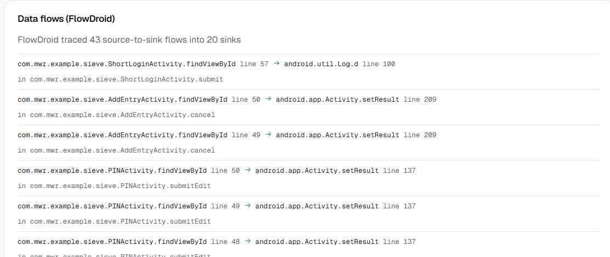

### 5. Correlation, exploitability and risk (M4), phases 7 and 8
- Every finding gets an exploitability rating with its reasons, for example "any installed app can reach it" or "a network attacker can read it".
- Attack chains link findings that combine, such as cleartext allowed plus an `http://` endpoint, or a hardcoded key plus data stored on the device.
- Risk score (0 to 100) = severity x exploitability x confidence. The app risk is the worst finding.

Proof:
```
$ python tests/test_m4.py
[OK] M4 check passed: top risk EXPORTED-COMPONENT-1 (72.0), app risk HIGH, data flows linked
```

### 6. Machine learning with explanations, phases 4 and 8
All three models are scored on the same LVDAndro test lines: 124,084 lines, of which 1.76% are vulnerable (the real rate). XGBoost and Random Forest train on 78,516 lines.

| Model | Precision | Recall | F1 | ROC-AUC | PR-AUC |
|---|---|---|---|---|---|
| Random Forest | 0.363 | 0.934 | 0.522 | 0.981 | 0.634 |
| **XGBoost (deployed for the risk score)** | **0.652** | 0.863 | **0.743** | 0.982 | **0.659** |
| CodeBERT, fine-tuned | 0.577 | 0.932 | 0.713 | **0.990** | 0.642 |

- CodeBERT is `microsoft/codebert-base` fine-tuned on 14,400 lines (1,600 vulnerable, the same 1:8 ratio as XGBoost) for one epoch at 64 tokens. That took 44 minutes on a laptop CPU.
- CodeBERT separates vulnerable from safe lines best (ROC-AUC 0.990). XGBoost wins on F1 and PR-AUC, which matter most when fewer than 2% of lines are vulnerable, and it trained on 5 times more lines.
- So XGBoost keeps adjusting the risk, by at most ±20%. It never creates a finding by itself; the rules stay the basis. SHAP shows the signals behind its score.
- Every finding with a code line gets three explanations: SHAP and LIME for the XGBoost score, and CodeBERT's attention map, a heatmap over the line from its last attention layer.
- Full details: `docs/FEATURES.md`.


Source: `app/modules/ml/meta.json` and `app/modules/ml/codebert_meta.json`.

### 7. Evaluation, phases 3 and 10
Unit: app x category. The labelling method is in `eval/ground_truth.json`, `eval/heldout.json` and `eval/benign.json`.

| Set | Apps | Result |
|---|---|---|
| Development | InsecureBankv2, AndroGoat, InsecureShop, OVAA | Precision 1.000, recall 0.947, F1 0.973 (TP 36, FP 0, FN 2) |
| **Held-out** | DIVA, Sieve, InjuredAndroid, Allsafe, Vuldroid | **Precision 0.875, recall 0.946, F1 0.909** (TP 35, FP 5, FN 2) |
| Benign | BinaryEye, PrivacyFriendlyNotes, Markor (F-Droid) | False-positive rate 0.375 (6 of 16 reported app x category pairs) |

- **Development:** the rules were fixed using these apps (first run F1 0.75), so these scores are optimistic.
- **Held-out:** each app's documented vulnerabilities were written down before any of them was scanned, and no rule was changed after seeing the results. Misses: Hardcoded Secrets in DIVA and InjuredAndroid. False alarms: `http://` strings the apps never connect to (UI text in DIVA, Flutter font notices in InjuredAndroid, SOAP namespace URIs in Allsafe), an intent key named `PASSWORD` in Sieve, and the Firebase URL that the SDK needs in Vuldroid. Issues outside the 16 categories or outside Java/Kotlin code (SQL injection, native and Flutter code, root detection, pinning bypass) are listed per app as out of scope.
- **Benign:** these apps are not vulnerable by design, so every category the scanner reports was checked by hand. The false alarms: URLs the apps never call, inside bundled JavaScript and input hints (HTTP Endpoints, BinaryEye and Markor); components exported on purpose as entry points (Exported Components, both); MD5 used only to display hashes (BinaryEye); and a `****` UI mask (Markor).

Prioritization, the rule-only baseline against the hybrid system. "Relevant" means the finding's category is one of the app's documented vulnerabilities.

| Ordering | Held-out P@5 | Held-out P@10 | Held-out MAP | Development MAP |
|---|---|---|---|---|
| Rule-only (severity, then confidence) | 0.64 | 0.68 | 0.734 | 0.954 |
| + M4 exploitability and attack chains | **0.84** | **0.78** | **0.811** | 0.964 |
| + ML-assisted risk (final score) | **0.84** | 0.76 | 0.806 | **0.965** |

On the held-out apps, M4 lifts mean average precision from 0.734 to 0.811 and precision@5 from 0.64 to 0.84. The ML adjustment adds nothing there (0.806) and helps only slightly on the development apps (0.965). It changes a risk by at most ±20%, so it mostly reorders findings of similar risk.

Scan time and memory, on a Windows laptop (16 GB RAM), with every step including FlowDroid and CodeBERT:

| App | Set | APK (MB) | Findings | Time (s) | Peak RAM (MB) |
|---|---|---|---|---|---|
| InsecureBankv2 | development | 3.3 | 23 | 75.1 | 2,071 |
| AndroGoat | development | 6.8 | 23 | 61.7 | 3,910 |
| InsecureShop | development | 4.5 | 22 | 52.5 | 3,134 |
| OVAA | development | 4.0 | 19 | 35.0 | 3,446 |
| DIVA | held-out | 1.4 | 15 | 45.2 | 1,114 |
| Sieve | held-out | 0.4 | 23 | 12.6 | 1,517 |
| InjuredAndroid | held-out | 23.6 | 21 | 73.4 | 2,522 |
| Allsafe | held-out | 10.4 | 23 | 71.1 | 4,551 |
| Vuldroid | held-out | 4.6 | 17 | 26.3 | 2,967 |
| BinaryEye | benign | 8.3 | 18 | 79.6 | 2,161 |
| PrivacyFriendlyNotes | benign | 8.1 | 6 | 84.7 | 3,893 |
| Markor | benign | 11.5 | 49 | 71.3 | 3,724 |

Every scan finished in under 1.5 minutes (median 66 seconds). Peak memory, counting jadx and FlowDroid, was at most 4,551 MB (median 3,050 MB). The first scan of each set also loads CodeBERT.

Sources: `eval/results.md`, `eval/results_heldout.md`, `eval/results_benign.md`; `python -m eval.benchmark dev|heldout|benign` reproduces them.

### 8. Web application, phase 9
- Flow: upload, then live progress, then the report, then HTML and PDF downloads. A running scan can be cancelled.
- The report is sorted by risk. Each finding shows:
  - its evidence
  - why it is exploitable
  - the linked findings
  - the OWASP mapping
  - the detection confidence
  - the ML and CodeBERT views
  - the fix
- Below the findings, the report lists the data flows.
- While a scan runs, a phone mockup animates each stage: validating, decompiling (DEX bytes to Java), rules scanning the code, and scoring.

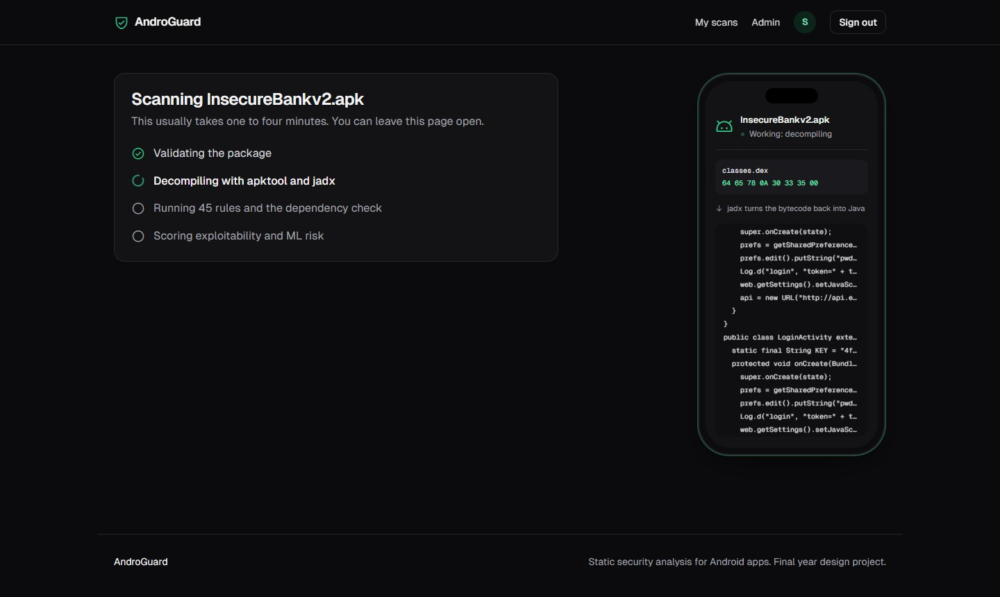

| Validating | Decompiling | Running rules | Scoring |
|---|---|---|---|
| 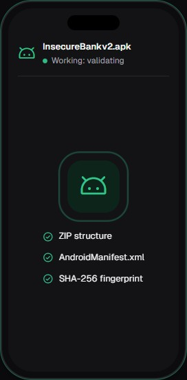 | 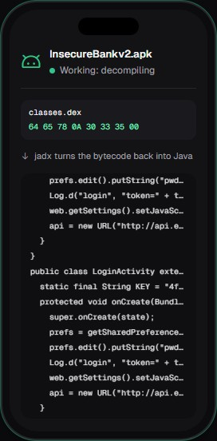 | 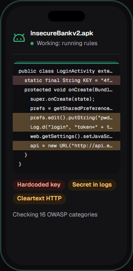 | 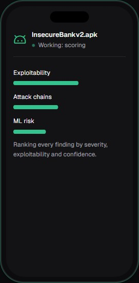 |

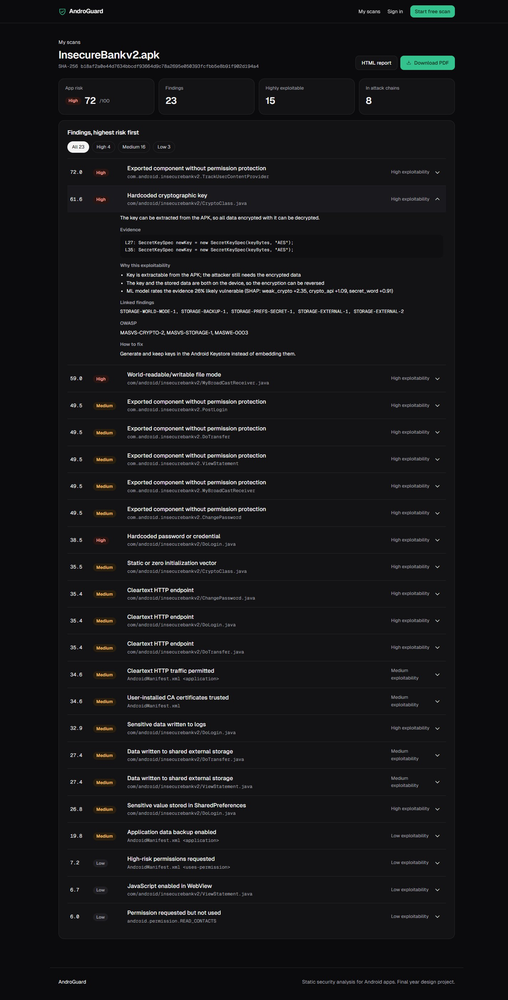

### 9. Free trial, accounts and admin CRM (beyond the proposal)
- **Free trial:** 3 free scans per browser without an account. The 4th attempt asks the visitor to create an account. Failed and cancelled scans do not count.
- **Accounts:**
  - Sign-up moves the trial scans into the new account, which gets 20 scans.
  - Admins can change a user's limit. Admins and the superadmin have no limit.
- **Roles:**
  - user < admin < superadmin.
  - Only the superadmin changes roles or deletes accounts.
  - An admin cannot edit another admin.
  - The superadmin account is created only from the command line.
- **CRM:**
  - Overview: users, scans, high-risk results, trial-to-account conversion, a 14-day chart and recent scans.
  - Users: search, role, block and unblock, scan limit, notes, delete.
  - Scans: search, status filter, delete.
- **Security:**
  - scrypt password hashes and server-side sessions in an HttpOnly cookie.
  - 5 failed logins in 15 minutes lock that login.
  - Blocking a user signs them out.
  - Another user's scan returns 404.

Proof:
```
$ python tests/test_api.py
[OK] API check passed: free trial quota, ownership, signup claim, login limit, cancel, roles, block and delete
```

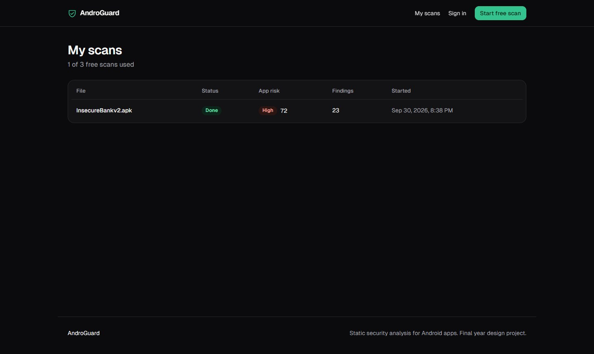
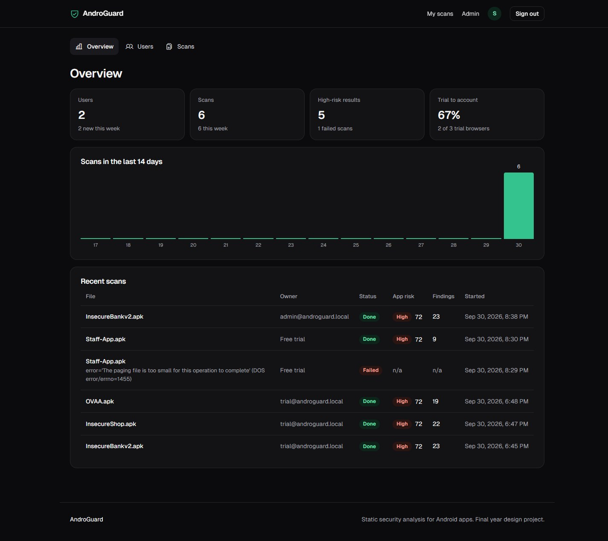
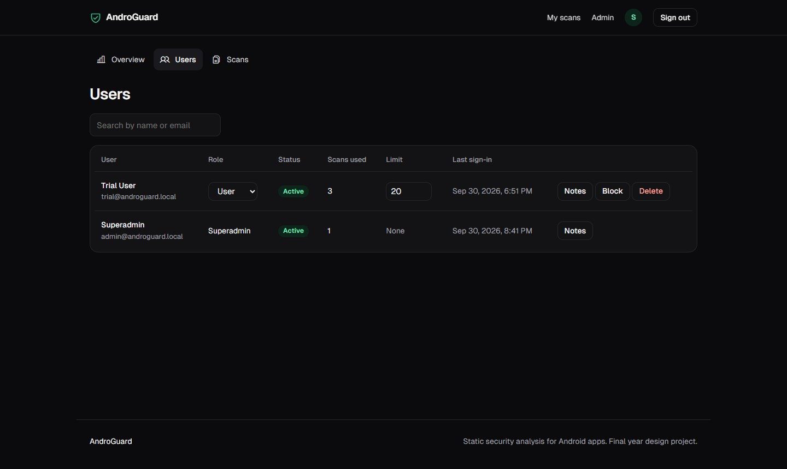
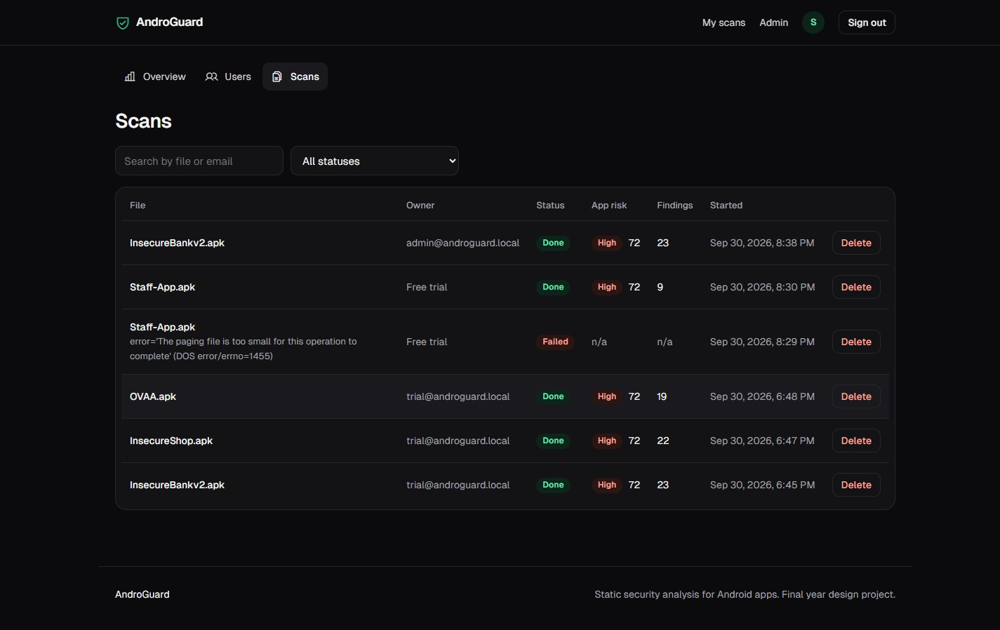

### 10. Landing site
The landing page has these parts:
- a hero with an animated green grid and a real sample report
- how it works
- what every scan checks
- privacy
- why choose AndroGuard
- an auto-playing demo card
- a final call to action

It supports dark and light mode and phone widths, and respects reduced motion.

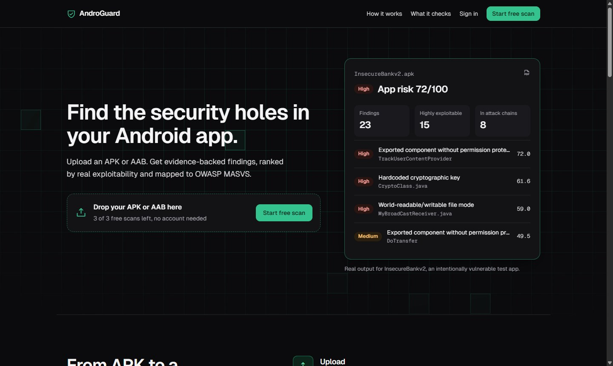
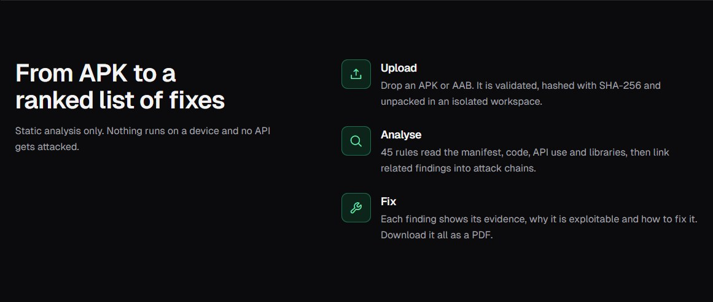
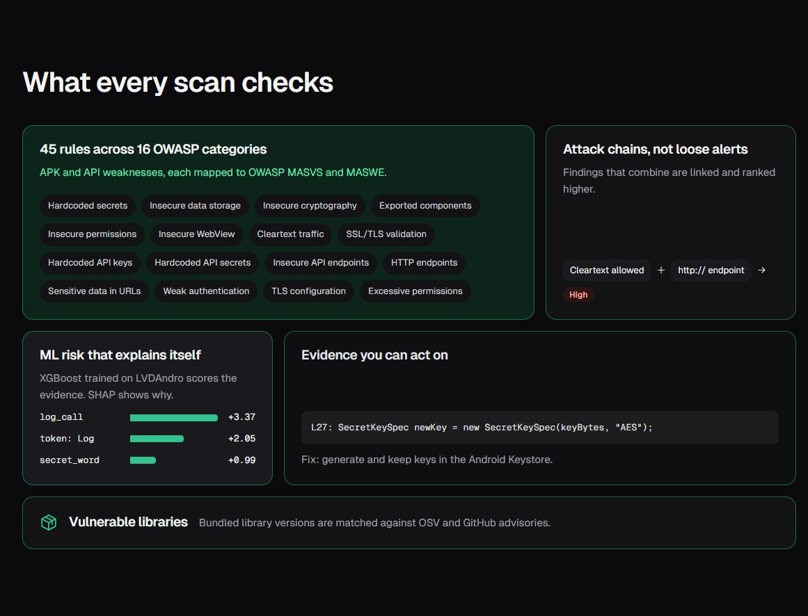
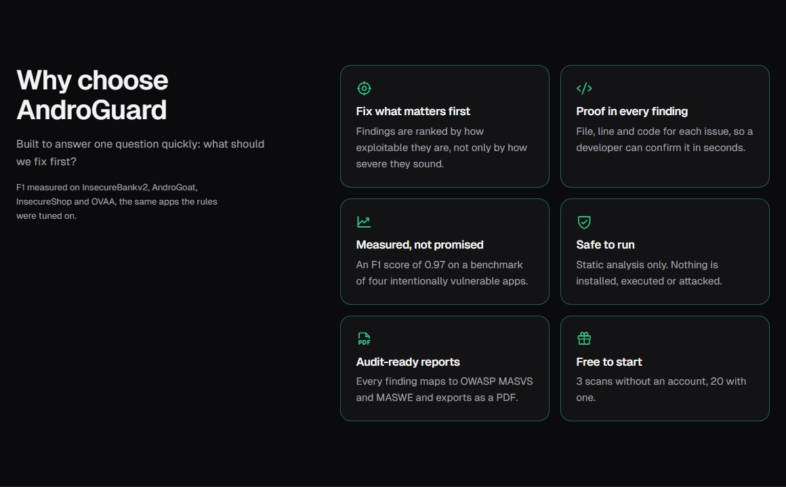
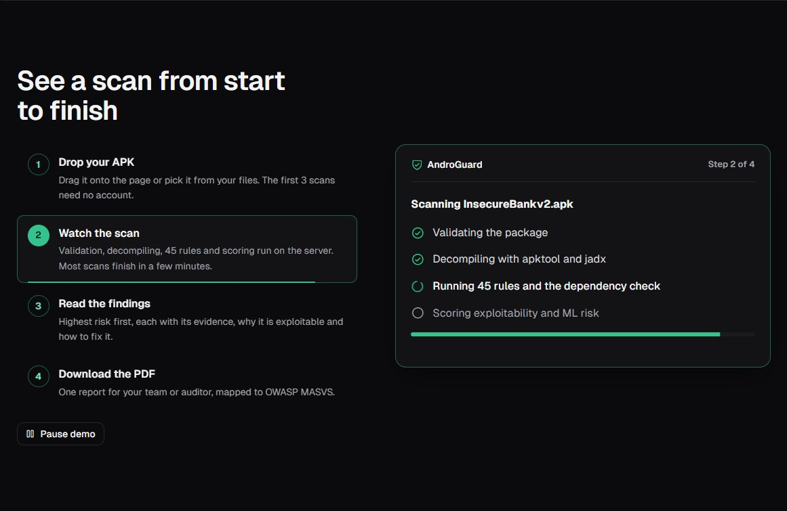

| Phone: landing | Phone: live scan |
|---|---|
| 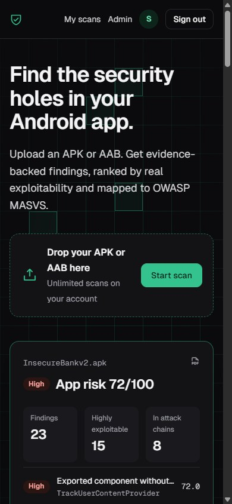 | 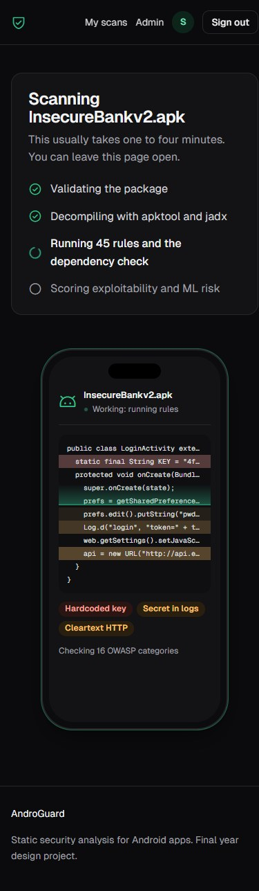 |

### 11. Docker, PostgreSQL and Docker Hub, phases 2 and 10
- The image is Debian with Python 3.12, OpenJDK 17, apktool 3.0.3, jadx 1.5.6, bundletool 1.18.3, FlowDroid 2.13, XGBoost, CPU-only PyTorch with the fine-tuned CodeBERT, and WeasyPrint for PDFs. It runs as a non-root user.
- On its own it keeps its data in SQLite on a Docker volume. `docker-compose.yml` runs it with PostgreSQL 16 instead.
- It is published as `minhal128/androguard` on Docker Hub: public, a 1.45 GB download, for x86-64.

Proof:
- Compose with PostgreSQL: InsecureBankv2 uploaded through the API finished in 96 seconds with 23 findings and risk 72.0, the same as on Windows. The PDF came from WeasyPrint (51,866 bytes, PDF 1.7). The user and the scan are stored in PostgreSQL.
- The published image in a fresh container: Sieve scanned in 26 seconds (23 findings, 43 data flows with the log leak first, CodeBERT on 10 findings) and the PDF downloaded (60,177 bytes). The admin CRM worked, and the data was still there after a container restart. An anonymous pull from Docker Hub was checked against the registry.

### 12. Privacy by design
- The uploaded file is saved under a server-chosen name and deleted when its scan ends. `tests/test_api.py` fails if any upload outlives its scan.
- The decompiled workspace is a temporary directory that is removed after every scan.
- Only the findings, the scores and the file's SHA-256 are stored.

## What remains (about 2%)

| Remaining work | Phase | Note |
|---|---|---|
| OpenAI summaries | 8 | Optional in the proposal. Left out on purpose: evidence lines can hold the scanned app's real secrets, and sending them to a third-party API would break privacy by design. |
| Deployment on a real Ubuntu server | 10 | The image runs on any Linux host with Docker. It was tested with Docker Desktop, not on a server. |
| Ghera and OWApp | 3 | Not used. The held-out set uses five other intentionally vulnerable apps. |
| Redis | 2 | Left out on purpose. One scan worker is enough because jadx needs gigabytes of RAM; the code names the upgrade path (Redis with RQ or Celery) for scans that must survive restarts or run on several machines. |

Known limits:
- False alarms on benign apps (rate 0.375): HTTP-ENDPOINT fires on URLs that apps never call, for example inside bundled JavaScript, and EXPORTED-COMPONENT fires on components exported on purpose.
- Held-out F1 is 0.909, against 0.973 on the development apps. Most of the gap is HTTP Endpoints false alarms and missed hardcoded secrets.
- FlowDroid 2.13 traced flows in only 3 of the 12 benchmark apps. When it works, the flows add evidence; when it does not, the rules carry the scan.
- CodeBERT was fine-tuned on 14,400 lines on a CPU. A GPU would allow all 78,516 training lines.
- Without an `NVD_API_KEY`, NVD answers 5 lookups per 30 seconds. Apps with many CVEs then get CVSS and CWE for the first few only.
- The image is built for x86-64. Apple Silicon Macs run it under emulation, which is slower.

Not counted in the percentage: the final FYP report (thesis) and the presentation.

## Work log: what Claude did

Team commits before this work: project setup and the first M3 pipeline by Waleed Kashif and Soha (`60570e2`, `10fcd49`, `567fde4`, `5232e28`, `9b8e0a3`, `09d7bbe`). Everything below was done by Claude. The commits were made from the minhal128 account, with Claude as co-author.

| When | Commit | What |
|---|---|---|
| 29 Sep | | Read the proposal and the code, and reported what was done and the % progress. Recommended the architecture. |
| 29 Sep | `ed4dc9a` | M3 fixes: shell-free tool calls, bundletool AAB, package validation, SHA-256, OSV severity from real data, the Phase 7 finding schema. |
| 29 Sep | `1af3860` | M1 APK analyzer: 28 rules across 8 categories, CLI scanner, fixture test. |
| 29 Sep | `e3340d6` | Fixes from the first real run on InsecureBankv2: a key passed through a local variable, regex/UI names flagged as secrets, apktool.bat hanging the CLI. |
| 29 Sep | `d1137c5` | M2 API analyzer (17 rules), a one-command scanner for M1 + M2 + OSV, React Native support. |
| 29 Sep | | Two walkthrough videos: slides (`docs/AndroGuard_walkthrough.mp4`), and a terminal run with English voice-over of a real QuickPay APK scan. |
| 30 Sep | `0ab582b` | Performance: a 28 MB React Native app now scans in about 2.5 min instead of 7.5. |
| 30 Sep | `4472c89` | False positives on translated labels and React Native/Expo modules (8 of 9 HIGH findings on one real app were wrong). |
| 30 Sep | `6d6b8f0` | M4 exploitability, attack chains and risk score; the ML model (RF vs XGBoost) with SHAP. |
| 30 Sep | `9dd5b6c` | Four-app benchmark, and rule fixes from its misses (F1 0.75 to 0.973 on the development set). |
| 30 Sep | `c888fff` | Web app: FastAPI + React UI, scan database, HTML/PDF reports. |
| 30 Sep | `25907ea` | Accounts, 3-scan free trial, roles and the admin CRM. |
| 30 Sep | `41a14cb` | Site design: landing page with animated grid, "Why choose" section, demo card, phone mockup on the scan page. |
| 30 Sep | `00b35db` | The 78% progress report with screenshots, after browser testing on desktop, phone, dark and light mode. |
| 30 Sep | | Full walkthrough video, 3 min 45 s, with English voice-over and captions (`Desktop/AndroGuard_full_walkthrough.mp4`). |
| 1 Oct | `a24994d` | Scan timeout and cancel, plain memory and disk errors, NVD CVSS and CWE, bundletool jar discovery, a real `.aab` test. |
| 1 Oct | `354c797` | FlowDroid data flows (DroidBench F1 0.826) linked into M4; fine-tuned CodeBERT compared with XGBoost and RF; detection confidence, CodeBERT attention and data flows in the web and PDF reports. |
| 1 Oct | `18ef81b` | Docker image with every tool and both models, PostgreSQL compose, published as `minhal128/androguard` on Docker Hub. |
| 1 Oct | `a202346` | Held-out, benign and DroidBench evaluations, the rule-only baseline, scan time and memory, and this report. |
| 1 Oct | this commit | LIME next to SHAP, CodeBERT attention maps as heatmaps in the web and PDF reports, and the feature documentation (`docs/FEATURES.md`). |

Bugs found on real apps and fixed:
- **Scanner failures (Windows and memory):**
  - jadx exits with code 3 on most real apps, and `jadx.bat` turns every error into 1. Both used to stop the scan.
  - `apktool.bat` waited on `pause` and hung the CLI.
  - jadx used up to 70% of RAM and crashed. It is now capped at 4 GB.
  - A hung tool kept a scan "running" until the server restarted. Tools now stop at a timeout.
- **Missed code:**
  - React Native/Hermes bundles over 1 MB were skipped, and their unquoted URLs were missed.
- **Wrong findings:**
  - Hardcoded credentials were missed in literal comparisons (`username.equals("devadmin")`), `user:pass@` URLs and promo codes.
  - AWS Cognito pool IDs were not treated as AWS keys.
  - `http://` inside protocol checks and error messages caused false alarms.
- **PDF:** Edge's launcher exits before the file is written, so PDFs were missing.
- **Website:**
  - The report showed the server's temporary file name instead of the real one.
  - The admin users table cut off the Block and Delete buttons.
  - The page overflowed sideways on phones.
  - The upload box accepted files after the free scans were used up.
  - The footer floated in the middle of short pages.
  - The data-flow list showed 30 flows between screens and hid Sieve's one flow into the log. Security sinks now come first.
  - Browsers kept the old `app.js` after an update. Static files are now revalidated on every load.

Git: this work is on branch `feat/finish-proposal`, merged into `main`.

## How to run

With Docker (nothing else to install):
```bash
docker run -d -p 8000:8000 -v androguard-db:/srv/db --name androguard minhal128/androguard
docker exec -it androguard python -m app.manage create-superadmin you@example.com
```
Open http://localhost:8000 and sign in with that account to reach Admin. Give Docker about 8 GB of memory.

From source:
```bash
pip install -r requirements.txt
python -m app.manage create-superadmin you@example.com
python -m uvicorn app.api:app --port 8000
```
apktool and jadx go in `tools/` or on the PATH. FlowDroid and CodeBERT are optional (see the README).

Tests:
```bash
python tests/test_m1.py
python tests/test_m2.py
python tests/test_m3_fixes.py
python tests/test_m4.py
python tests/test_ml.py
python tests/test_api.py
```

On Windows, run `tests/test_m3.py` with `PYTHONIOENCODING=utf-8`, because it prints a ✓ that the default console encoding cannot show.
